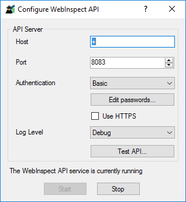

[](https://ci.appveyor.com/project/akevinlee/powershellforwebinspect)

# Power Shell For WebInspect Module

#### Table of Contents

*   [Overview](#overview)
*   [Current API Support](#current-api-support)
*   [Installation](#installation)
*   [Configuration](#configuration)
*   [Example](#example)
*   [Logging](#logging)
*   [Developing and Contributing](#developing-and-contributing)
*   [Licensing](#licensing)

## Overview

This is a [PowerShell](https://microsoft.com/powershell) [module](https://technet.microsoft.com/en-us/library/dd901839.aspx)
that provides command-line interaction and automation for the [WebInspect API](http://localhost:8083/webinspect/swagger/ui/index).

 

## Use Cases

Although the module can be used generically, some use cases where it can be applied include:

 * Automating scans and reports from a PowerShell command line and scripts.
 * Running Dynamic Scans from third party build tools where a plugin is not currently available.  
 * Programatically creating dashboards from WebInspect data together with data from other sources.  
        
----------

## Current API Support

At present, this module can:
 * Authenticate against the WebInspect API using (none, Basic and Windows authentication)
 * Execute a generic WebInspect API REST command with authentication
 * Query, run, start, stop and remove Scans

Development is ongoing, with the goal to add broad support for the entire API set.

Review example [usage](USAGE.md) to see how the module can be used to accomplish some example tasks.

----------

## Installation

You can get the latest release of the PowerShellForWebInspect from the [PowerShell Gallery](https://www.powershellgallery.com/packages/PowerShellForWebInspect)

```PowerShell
Install-Module -Name PowerShellForWebInspect
```

----------

## Configuration

To access the [WebInspect](https://www.microfocus.com/en-us/products/webinspect-dynamic-analysis-dast/) API you will need to 
have installed WebInspect as per the [documentation](https://www.microfocus.com/documentation/fortify-webinspect/) and 
started the Windows **WebInspect API Service** either automatically or using the **Micro Focus Fortify Monitor Tool**. 
Using the Monitor tool you can configure the Authentication method to use:



Assuming you have configured **Basic** Authentication, then you can configure this module using the following:

```PowerShell
$Credential = Get-Credential
Set-WIConfig -ApiUri http://localhost:8083/webinspect -AuthMethod Basic -Credential $Credential
```

You will be requested for your authentication details after the first command which will then be stored on the filesystem
for all future requests. For more information on how to authenticate please refer to [USAGE](USAGE.md).

## Example

Example command:

```powershell
Get-WIScans -Status "complete" -Name 'test' | Out-GridView
```

For more example commands, please refer to [USAGE](USAGE.md).

----------

## Developing and Contributing

Please see the [Contribution Guide](CONTRIBUTING.md) for information on how to develop and contribute.

If you have any problems, please consult [GitHub Issues](https://github.com/fortify-community-plugins/PowerShellForWebInspect/issues)
to see if has already been discussed.

----------

## Licensing

PowerShellForWebInspect is licensed under the [GNU General Public license](LICENSE).


